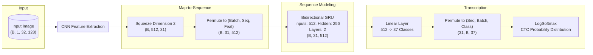

## CRNN

```mermaid
graph LR
    subgraph Input
        InputImage[("Input Image<br/>(B, 1, 32, 128)")]
    end

    subgraph CNN_Backbone ["CNN Feature Extraction"]
        direction LR
        C1["Conv2d: 64, 3x3, s1, p1"] --> R1[ReLU] --> P1["MaxPool: 2x2, s2<br/>(B, 64, 16, 64)"]
        P1 --> C2["Conv2d: 128, 3x3, s1, p1"] --> R2[ReLU] --> P2["MaxPool: 2x2, s2<br/>(B, 128, 8, 32)"]
        P2 --> C3["Conv2d: 256, 3x3, s1, p1"] --> BN1[BatchNorm] --> R3[ReLU]
        R3 --> C4["Conv2d: 256, 3x3, s1, p1"] --> R4[ReLU] --> P3["MaxPool: (2,1), s(2,1)<br/>(B, 256, 4, 32)"]
        P3 --> C5["Conv2d: 512, 3x3, s1, p1"] --> BN2[BatchNorm] --> R5[ReLU]
        R5 --> C6["Conv2d: 512, 3x3, s1, p1"] --> R6[ReLU] --> P4["MaxPool: (2,1), s(2,1)<br/>(B, 512, 2, 32)"]
        P4 --> C7["Conv2d: 512, 2x2, s1, p0"] --> BN3[BatchNorm] --> R7["ReLU<br/>(B, 512, 1, 31)"]
    end

    subgraph Reshape ["Map-to-Sequence"]
        S1["Squeeze Dimension 2<br/>(B, 512, 31)"] --> Perm1["Permute to (Batch, Seq, Feat)<br/>(B, 31, 512)"]
    end

    subgraph RNN_Backbone ["Sequence Modeling"]
        BiGRU["Bidirectional GRU<br/>Inputs: 512, Hidden: 256<br/>Layers: 2<br/>(B, 31, 512)"]
    end

    subgraph Classification ["Transcription"]
        FC["Linear Layer<br/>512 -> 37 Classes"] --> Perm2["Permute to (Seq, Batch, Class)<br/>(31, B, 37)"] --> LogSoft["LogSoftmax<br/>CTC Probability Distribution"]
    end

    InputImage --> C1
    R7 --> S1
    Perm1 --> BiGRU
    BiGRU --> FC
```

```mermaid
graph LR
    subgraph Input
        InputImage[("Input Image<br/>(B, 1, 32, 128)")]
    end

    subgraph CNN_Backbone ["CNN Feature Extraction"]
    end

    subgraph Reshape ["Map-to-Sequence"]
        S1["Squeeze Dimension 2<br/>(B, 512, 31)"] --> Perm1["Permute to (Batch, Seq, Feat)<br/>(B, 31, 512)"]
    end

    subgraph RNN_Backbone ["Sequence Modeling"]
        BiGRU["Bidirectional GRU<br/>Inputs: 512, Hidden: 256<br/>Layers: 2<br/>(B, 31, 512)"]
    end

    subgraph Classification ["Transcription"]
        FC["Linear Layer<br/>512 -> 37 Classes"] --> Perm2["Permute to (Seq, Batch, Class)<br/>(31, B, 37)"] --> LogSoft["LogSoftmax<br/>CTC Probability Distribution"]
    end

    InputImage --> CNN_Backbone
    CNN_Backbone --> S1
    Perm1 --> BiGRU
    BiGRU --> FC
```

```mermaid
graph LR
    subgraph CNN_Backbone ["CNN Feature Extraction"]
        direction LR
        C1["Conv2d: 64, 3x3, s1, p1"] --> R1[ReLU] --> P1["MaxPool: 2x2, s2<br/>(B, 64, 16, 64)"]
        P1 --> C2["Conv2d: 128, 3x3, s1, p1"] --> R2[ReLU] --> P2["MaxPool: 2x2, s2<br/>(B, 128, 8, 32)"]
        P2 --> C3["Conv2d: 256, 3x3, s1, p1"] --> BN1[BatchNorm] --> R3[ReLU]
        R3 --> C4["Conv2d: 256, 3x3, s1, p1"] --> R4[ReLU] --> P3["MaxPool: (2,1), s(2,1)<br/>(B, 256, 4, 32)"]
        P3 --> C5["Conv2d: 512, 3x3, s1, p1"] --> BN2[BatchNorm] --> R5[ReLU]
        R5 --> C6["Conv2d: 512, 3x3, s1, p1"] --> R6[ReLU] --> P4["MaxPool: (2,1), s(2,1)<br/>(B, 512, 2, 32)"]
        P4 --> C7["Conv2d: 512, 2x2, s1, p0"] --> BN3[BatchNorm] --> R7["ReLU<br/>(B, 512, 1, 31)"]
    end

```